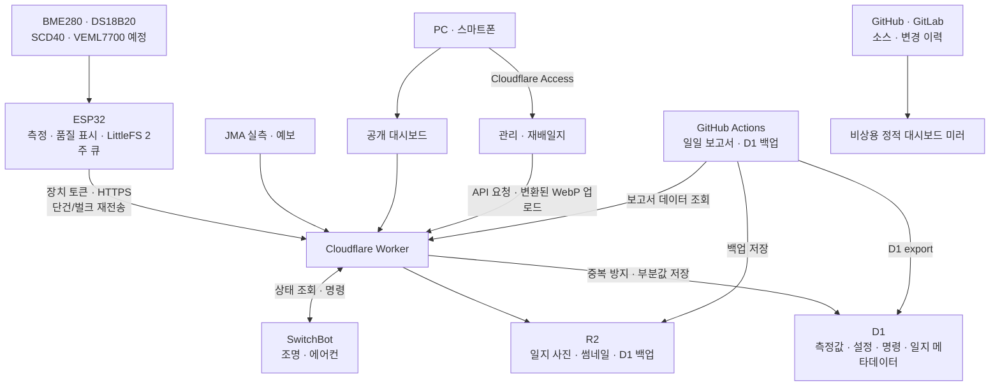

# Hydroponics Cloud Platform Roadmap

이 문서는 현재의 단일 ESP32 수경재배 모니터를 개인용 재배 관리 시스템으로
확장하기 위한 방향을 정리한다. 구현 순서는 안정적인 측정과 복구를 우선한다.
2026-08-09부터 운영 데이터 경로는 Cloudflare로 단일화했으며 ThingSpeak는 사용하지 않는다.

실행 가능한 작업, 우선순위와 진행 상태는
[Hydroponics Cloud Platform GitHub Project](https://github.com/users/Flammenwerfer41/projects/1)에서 관리한다.

## 현재 기준선

2026-08-12 현재 다음 구성이 실제 운영 중이다.

- ESP32 펌웨어 v8.4.0: BME280·DS18B20 측정, LittleFS 14일 큐,
  Cloudflare 단건·벌크 전송과 ArduinoOTA
- Cloudflare Worker: D1 수집·조회, 공개·관리 대시보드, JMA 수집,
  SwitchBot 제어, 재배일지, 경고 판정
- D1: 센서값, 조명 이력, JMA 실측, 일지 메타데이터, 경고 상태와 감사 기록
- R2: 재배일지 WebP 원본·썸네일과 D1 정기 백업
- Cloudflare Access: 관리자 화면과 쓰기 API 보호
- Discord: 지속시간 기반 주의·경보·복구 알림

펌웨어 3차 리팩터링과 OTA 검증까지 완료했다. 다음 즉시 작업은 24~48시간
운영 관찰과 v8.4.0 릴리스 확정이며, 다음 기능 확장은 실제 하드웨어가 도착한 뒤
SCD40과 VEML7700을 추가하는 것이다.

## 목표

- ESP32가 인터넷 단절 중에도 측정과 안전 동작을 지속한다.
- Cloudflare가 측정 데이터, 기상 데이터, 재배일지와 사진을 통합 관리한다.
- 한 장소와 한 타워에 종속되지 않는 데이터 구조를 처음부터 사용한다.
- 센서 일부가 실패해도 유효한 측정값은 보존한다.
- 사용자가 자신의 원본 데이터를 언제든 내보내고 복구할 수 있게 한다.
- 원격 제어보다 기록 품질, 장애 감지와 안전성을 먼저 완성한다.

## 목표 아키텍처



## 핵심 데이터 개념

확장성을 위해 UI 명칭과 데이터 식별자를 분리한다. 화면에 표시되는 이름은
언제든 바꿀 수 있지만 ID는 생성 후 변경하지 않는다.

### 장소와 재배 구획

- `site`: 집, 온실, 농장 등 물리적 장소
- `zone`: 타워, 선반, 양액 탱크 등 독립적으로 관리하는 구획
- `slot`: 한 타워 안의 식재 위치 또는 포트
- `crop`: 바질, 깻잎 등 작물 종류와 기본 환경 기준
- `crop_cycle`: 파종·정식부터 종료·수확까지의 재배 주기
- `planting`: 특정 재배 주기에 속한 작물, 구획, 수량의 관계

예를 들어 현재 환경은 다음처럼 표현할 수 있다.

```text
site: home-lab
zone: tower-01
crop cycle: 2026-summer-01
plantings:
  - basil × 3
  - perilla × 2
```

수량은 고정 속성이 아니라 정식, 솎아내기, 고사, 수확 이벤트에 따라 변경될 수
있도록 이력으로 관리한다.

### 장치와 센서

- `device`: ESP32 또는 장래의 현장 게이트웨이
- `sensor`: 장치에 연결된 개별 센서
- `metric`: air_temperature, humidity, pressure, water_temperature 등 측정 종류.
  향후 `co2_concentration`, `illuminance`를 같은 방식으로 추가한다.
- `actuator`: 조명, 펌프, 팬, 밸브 등 제어 대상
- `firmware_release`: 장치에 설치된 펌웨어 버전과 설정 규격

센서에는 다음 정보를 기록한다.

- 변경되지 않는 센서 ID
- 사용자가 수정할 수 있는 이름
- 설치 장소와 구획
- 센서 종류와 모델
- 핀 또는 버스 주소
- 설치·교체·폐기 시각
- 보정값과 보정 이력
- 현재 활성 상태

센서 교체 시 기존 센서의 ID를 재사용하지 않는다. 그래야 장기간 그래프에서
값의 변화가 환경 변화인지 센서 교체 영향인지 구분할 수 있다.

### 측정 기록

측정 레코드는 다음 정보를 포함하는 것을 기본으로 한다.

```json
{
  "reading_id": "장치에서 생성한 고유 ID",
  "device_id": "esp32-01",
  "site_id": "home-lab",
  "zone_id": "tower-01",
  "measured_at": "2026-08-08T22:30:00+09:00",
  "received_at": "2026-08-08T22:30:04+09:00",
  "sequence": 182341,
  "firmware_version": "8.1.0",
  "values": {
    "air_temperature": 25.3,
    "humidity": 61.2,
    "pressure": 1007.8,
    "water_temperature": 24.6
  },
  "quality": {
    "air_temperature": "valid",
    "humidity": "valid",
    "pressure": "valid",
    "water_temperature": "valid"
  }
}
```

`measured_at`은 장치 측정시각, `received_at`은 서버 수신시각이다. 둘을 모두
보존해 오프라인 복구 데이터와 장치 시계 오차를 판별한다.

## 고유 ID와 전송 신뢰성

### 측정 ID

- 모든 측정 주기에 장치별 고유 `reading_id`를 부여한다.
- D1에는 `(device_id, reading_id)` 고유 제약을 두어 재전송 중복을 방지한다.
- 장치는 서버가 해당 ID를 확인한 뒤에만 LittleFS 기록을 전송 완료로 표시한다.
- 단건 업로드와 벌크 복구가 동일한 저장 함수를 사용하게 한다.
- 벌크 응답은 각 ID별 `accepted`, `duplicate`, `rejected` 결과를 반환한다.

### 순서와 재부팅 식별

- 한 부팅 안에서 단조 증가하는 `sequence`로 데이터 단절과 순서 역전을 판별한다.
- 각 부팅에 `boot_id`를 부여해 재부팅 전후의 순서를 구분한다.
- 현재는 재부팅 원인을 기록한다. 누적 부팅 횟수와 Wi-Fi 재연결 횟수는 실제
  운영 진단에 필요해질 때 별도 상태 레코드로 추가한다.
- 서버 명령에는 고유 ID, 만료시각과 중복 실행 방지 정보가 반드시 들어간다.

### 품질 플래그

행 전체가 아닌 필드별로 품질을 기록한다.

- `valid`: 정상 측정
- `missing`: 센서 응답 없음
- `invalid`: 규격 밖의 값
- `stale`: 새 측정이 아닌 이전 값
- `suspect`: 급변·고정 등 이상 징후
- `calibrating`: 보정 또는 안정화 중

오류 원본값도 필요하면 별도 진단 필드에 보존하되 정상 통계에서는 제외한다.

## 재배일지와 사진 기록

### 일지 항목

관리자 화면에서 다음을 기록할 수 있게 한다.

- 파종, 발아, 정식, 솎아내기, 전정, 수확, 재배 종료
- 양액 제조·교체·보충
- EC·pH·수위 수동 측정
- 조명 높이·스케줄 변경
- 펌프·배관·센서 청소 및 교체
- 병충해·잎 변색·생육 이상 발견
- 자유 메모와 사용자 정의 태그

현재 일지는 날짜를 기준으로 공통 관리 기록과 작물별 기록을 묶고, 작물·활동 태그로
탐색한다. 취미 재배에서 불필요한 입력 부담을 피하기 위해 `crop_cycle` 관리와 그래프
이벤트 연결은 보류한다. 재배 규모가 커져 실제 필요가 생기면 기존 날짜·작물 구조 위에
선택 기능으로 추가한다.

### 사진

- 스마트폰 카메라 촬영과 갤러리 선택을 모두 지원한다.
- 브라우저에서 긴 변과 품질을 제한해 업로드 용량을 줄인다.
- 원본 또는 적정 크기 이미지와 썸네일을 R2에 저장한다.
- D1에는 R2 객체 키, 촬영시각, 설명, 작물, 구획과 일지 ID만 저장한다.
- MIME 형식, 파일 크기와 실제 이미지 여부를 Worker에서 다시 검증한다.
- EXIF 위치정보는 기본적으로 제거한다.
- 삭제는 DB와 R2가 불일치하지 않도록 복구 가능한 2단계 방식으로 처리한다.

장래에는 같은 촬영 위치를 위한 화면 가이드, 전후 비교와 성장 타임랩스를 추가할
수 있다.

## 관리자 로그인과 권한

공개 대시보드는 읽기 전용으로 유지하고 관리자 기능은 분리한다.

- `/`: 공개 또는 제한된 읽기 전용 대시보드
- `/admin`: 로그인한 관리자만 접근
- `/api/upload`: 등록된 장치만 접근
- `/api/admin/*`: 관리자 세션만 접근

초기에는 Cloudflare Access 또는 서버 측 세션을 이용한 단일 관리자 로그인을
사용한다. 장래에는 다음 역할을 고려한다.

- `viewer`: 데이터와 일지 열람
- `editor`: 일지·사진·재배 설정 관리
- `operator`: 장치 설정과 제한된 제어
- `owner`: 사용자·장치·인증정보 관리

보안 원칙:

- 관리자 비밀번호, 세션 비밀키, Discord Webhook과 장치 키는 Git에 저장하지 않는다.
- 브라우저 JavaScript에 관리자 키나 장치 키를 포함하지 않는다.
- 쿠키 기반 세션은 `Secure`, `HttpOnly`, `SameSite`를 사용한다.
- 변경 API에는 CSRF 방어와 요청 크기 제한을 적용한다.
- 로그인, 설정 변경, 사진 삭제, 원격 명령을 감사 로그에 남긴다.
- 장치별 키를 분리해 한 장치의 키만 폐기·교체할 수 있게 한다.

## JMA 데이터 저장

현재 화면 표시용으로 사용하는 JMA 실측을 D1에 장기 저장하고, 예보는 최신
도쿄지방 발표본 하나만 캐시한다.

### 실측

- 도쿄 관측소 환경값과 세타가야 강수량
- 관측소 ID와 이름
- 실제 관측시각과 서버 취득시각
- 각 값의 JMA 품질 상태
- 기온, 습도, 기압, 강수, 풍향·풍속, 일조

### 예보

- 도쿄지방 코드 `130010`
- 발표시각
- 각 3시간 구간의 유효시각과 기간
- 날씨, 기온, 풍향·풍속
- 원본 발표를 식별할 수 있는 정보

동일한 관측을 다시 읽어도 중복되지 않도록 고유 제약을 둔다. 실내 센서 데이터와
JMA 데이터는 테이블을 분리하고 필요할 때 분석 API에서 시간축으로 결합한다.

저장한 데이터로 다음을 계산할 수 있다.

- 외기 대비 실내 온도·습도 차이
- 외기 변화가 실내와 수온에 반영되는 지연시간
- 날씨별 실내 습도 변화
- 외부 고온 예보와 고수온 위험
- 계절별 재배환경 유지 성능

## 이상 감지와 Discord 알림

이상 판정은 순간값 하나보다 지속시간과 최근 이력을 사용한다.

현재 감지 대상:

- 10분·30분 이상 데이터 단절
- 기온·습도·기압·수온의 반복 결측
- 고온·저온, 고VPD, 고수온·저수온의 지속
- 조명 상태와 소비전력 불일치

장시간 고정값, 비현실적인 급변, Wi-Fi RSSI, 반복 재부팅과 대량 LittleFS
복구 감지는 실제 오탐 사례와 필요가 생길 때 추가한다. 현재 Wi-Fi 품질은 의도적으로
경고 대상에서 제외했다. Plug Mini 상태·전력 불일치 규칙은 유지하되, 별도 조도센서로
실제 점등 여부를 판정하는 기능은 필요성이 낮아 보류한다.

알림에는 장소, 구획, 장치, 최초 발생시각, 지속시간, 최근값과 대시보드 링크를
포함한다. Discord Webhook은 Worker의 Secret으로 관리한다.

같은 상태를 반복 전송하지 않도록 현재 다음 상태 전이를 관리한다.

```text
normal → (지속시간 충족) → warning → critical
warning/critical → (복구시간 충족) → normal
```

- 임계값을 일정 시간 넘긴 뒤에만 알림을 발송한다.
- 동일 장애에는 냉각시간을 적용한다.
- 값이 정상화되면 복구 알림을 한 번 발송한다.
- 알림 전송 실패가 센서 데이터 저장 실패로 이어지지 않게 분리한다.
- 관리자의 확인·해제 상태는 향후 이력 화면과 함께 추가한다.

## 조회, 집계와 보존

### D1

- 최근 원시 측정값
- 시간별·일별 집계
- 장치·센서·재배 주기 설정
- 일지·이벤트·알림·사진 메타데이터
- JMA 실측과 예보

시간 범위 조회에 사용하는 열은 인덱스를 둔다. 7일·30일 그래프는 매번 원시
데이터 전체를 읽지 않고 미리 만든 시간별 집계를 사용한다.

### R2

- 재배일지 사진과 썸네일
- 일별 또는 월별 센서 원본 내보내기
- D1 정기 백업
- 사용자가 요청한 전체 데이터 다운로드 파일

보존 정책은 용량과 무료 한도에 묶어 하드코딩하지 않고 설정으로 관리한다.
CSV/JSON 내보내기를 정기적으로 검증해 특정 서비스에 종속되지 않게 한다.

## 단계별 구현 계획

### 0. 규격 확정과 안전 준비

- 위 데이터 개념과 ID 규칙 확정
- 현재 ThingSpeak와 LittleFS 형식 백업
- D1 마이그레이션과 롤백 절차 마련
- 비밀정보와 환경별 설정 목록 정리

완료 기준: 샘플 데이터를 이용해 중복, 부분 결측, 오프라인 재전송 사례를 모두
표현할 수 있다.

진행 상태: 완료. 현재 D1 계약, 필드별 품질, 부팅 ID·순번과 마이그레이션 절차가
운영 코드와 자동 테스트에 반영되어 있다.

### 1. Cloudflare 측정 데이터 브리지

- D1 스키마와 마이그레이션 추가
- 장치 인증 업로드 API 추가
- 단건·벌크 업로드와 중복 방지 구현
- 최근값·일·주·월 조회 API 구현
- 시간별·일별 집계 구현

이 단계에서는 ESP32가 ThingSpeak와 Cloudflare에 동시 전송한다.

완료 기준: 최소 2주간 두 저장소의 정상 데이터 수, 결측과 복구 결과가 일치한다.

진행 상태: 기능 완료. ThingSpeak 과거 자료 이관과 Cloudflare 단독 수집 전환까지
끝났고 중복·부분 결측·지연 재전송을 D1에서 검증했다. 원래 계획한 2주 병행 운용은
채우지 않고 조기 전환했으며, 5,778건 원본 대조, LittleFS 복구와 전환 후 연속성
검증으로 이를 보완했다.

### 2. Cloudflare 대시보드 전환

- 현재 정적 대시보드를 Workers Static Assets로 배포
- 동일 출처의 조회 API 사용
- GitHub/GitLab Pages를 읽기 전용 비상 미러로 유지
- 데이터 내보내기와 상태 화면 추가

완료 기준: ThingSpeak 조회 없이 모든 기존 그래프와 상태가 표시된다.

진행 상태: 완료. Worker가 운영 대시보드와 API를 제공하고 GitHub/GitLab Pages는
읽기 전용 비상 미러로 유지한다.

### 3. 관리자와 재배일지

- 관리자 로그인과 권한 검사
- 날짜별 공통 메모와 작물별 기록
- 작물·활동 태그 탐색
- 모바일 사진 업로드, R2 저장과 썸네일

현재 진행 상태:

- 완료: Cloudflare Access 기반 관리자 인증
- 완료: 날짜별 공통 관리 기록과 일지 전체 공개 설정
- 완료: 바질·깻잎 작물별 기록과 활동 태그
- 완료: 수동 pH·EC·양액 보충량 기록
- 완료: 일일 대표 사진 1장과 작물별 최대 6장 업로드
- 완료: 브라우저 WASM WebP 변환, R2 원본·썸네일 저장과 Access 보호
- 완료: 공개 지정 일지만 노출하는 읽기 전용 일지와 사진 조회
- 완료: 실패한 R2 삭제를 큐에 보관하고 시간당 재처리하는 정리 작업
- 보류: 장소·구획·작물·재배 주기 편집 화면
- 보류: 사진의 재배 주기 연결과 그래프 이벤트 표시

완료 기준: 스마트폰에서 날짜별·작물별 메모와 사진을 관리하고, 공개로 지정한
기록만 외부 방문자가 읽을 수 있다.

### 4. JMA 보관과 분석

- 완료: JMA 실측을 10분 관측 시각 기준으로 중복 없이 장기 저장
- 완료: 최근 2시간 누락 복구와 마지막 정상 관측값 유지
- 완료: 예보 이력 대신 최신 도쿄지방 발표본 하나만 캐시
- 부분 완료: 대시보드의 실내외 동시 표시
- 예정: 장기 상관 분석을 위한 실내외 시간축 결합 API
- 보류: 예보 기반 위험 표시와 예보 이력 보관

완료 기준: 외부 API가 잠시 실패해도 마지막 정상 JMA 데이터와 출처 시각을
표시할 수 있다.

진행 상태: 일일 보고서 브리지는 2026-08-09부터 ThingSpeak 대신 D1의 센서 및
조명 이력을 사용한다. JMA 실측 장기 보관과 최근 2시간 누락 복구도 운영 중이다.
예보는 대시보드 표시용 최신 발표만 유지하며 자동 위험 판정에는 사용하지 않는다.

### 5. 이상 감지와 Discord

- 품질 규칙과 지속시간 기반 상태 머신
- Discord 발생·복구 알림
- 알림 확인과 이력 화면
- 센서·구획별 임계값 설정

완료 기준: 시험용 단절과 임계값 초과가 중복 없이 한 번 알림되고 정상화 시 복구
알림이 발송된다.

진행 상태:

- 완료: D1 기반 `normal`·`warning`·`critical` 상태와 지속시간·히스테리시스
- 완료: Discord 발생·격상·복구 알림, 실패 재시도와 중복 방지
- 완료: 공개 대시보드의 활성 경고 전광판과 운영 테스트
- 보류: 관리자용 알림 확인·전체 이력 화면
- 보류: 관리자 화면에서 센서·구획별 임계값 편집

### 6. ThingSpeak 종료

- 병행 기간의 데이터와 복구 결과 비교
- ThingSpeak 의존 API와 인증정보 제거
- ESP32 전송 대상을 Cloudflare로 전환
- R2 백업 복원 시험
- 문서와 운영 절차 갱신

완료 기준: ThingSpeak를 차단한 상태에서도 측정, 복구, 그래프, 보고서와 알림이
모두 동작한다.

진행 상태: 2026-08-09 v8.4.0에서 활성 펌웨어 송신, 일일 보고서와 정기 워크플로의
ThingSpeak 의존성을 제거했다. 과거 데이터 5,778건이 D1에 이관된 것을 원본과
대조했으며, 완료된 일회성 백필 스크립트와 예약 워크플로도 제거했다. 이관 결과는
D1의 `source = 'thingspeak_backfill'` 데이터와 Git 이력으로 보존한다.

단계 상태: 완료.

### 7. SwitchBot 제어

- 완료: 조명의 원하는 스케줄과 Plug Mini 실제 상태 분리
- 완료: JST 07:00 ON / 21:00 OFF 스케줄과 관리자 화면 편집
- 완료: 다음 스케줄 전환까지 유효한 조명 수동 명령
- 완료: 에어컨 수동 명령과 마지막 명령 표시
- 완료: 명령 결과와 관리자 감사 기록
- 보류: 고온 시 조명 자동 정지 등 환경 연동 자동제어

조명 스케줄과 원격 명령은 Worker가 담당하며 ESP32 센서 펌웨어와 분리되어 있다.
에어컨은 적외선 장치라 실제 상태 확인이 불가능하므로 자동제어하지 않는다.
SwitchBot 앱은 계정 복구와 클라우드 제어 장애 시 수동 우회 수단으로 유지한다.

### 8. 안정화와 센서 확장

- 완료: 센서, 레코드 인코딩, 링 저장소와 클라우드 업로드 모듈 분리
- 완료: 공통 설정, 네트워크 서비스와 측정 컨트롤러 분리
- 완료: 일반·OTA 빌드, Worker 회귀 테스트와 실제 OTA 검증
- 진행: 리팩터링 이후 24~48시간 D1 연속성·결측·재부팅 관찰
- 예정: 안정화 확인 후 v8.4.0 Git 태그와 GitHub Release
- 예정: SCD40 CO₂와 VEML7700 조도 센서의 전원·I2C 하드웨어 검증
- 예정: `co2_concentration`·`illuminance` 품질, 저장, 조회와 대시보드 확장
- 보류: 실제 식물등·설치 위치 보정 전 조도→PPFD 환산

현재 수직 타워, ESP32, BME280, DS18B20과 SwitchBot 구성은 유지한다. 센서 확장은
실물 보드의 전원 회로와 3.3V 동작을 확인한 뒤 드라이버, 저장 규격, 클라우드 계약,
화면 순으로 작은 변경 단위로 진행한다.

## 당분간 구현하지 않을 것

- 클라우드 연결이 없으면 작동하지 않는 펌프·조명 제어
- 센서 오류 하나로 전체 측정 행을 폐기하는 방식
- 사진을 D1 BLOB으로 직접 저장하는 방식
- 공개 JavaScript에 관리자 또는 장치 인증정보 포함
- 30일 원시 데이터를 매 새로고침마다 전체 스캔하는 조회
- ThingSpeak를 운영 데이터 경로로 다시 추가
- 저장·알림·자동제어를 한 번에 변경하는 대규모 배포
- 실측 보정 없이 조도값을 고정 계수로 PPFD라고 표시하는 기능

## 운영 원칙

- 스키마 변경은 버전이 있는 마이그레이션으로 관리한다.
- 기능 변경, 펌웨어 구조 변경과 데이터 마이그레이션은 작은 커밋으로 분리한다.
- 배포 전 자동 테스트와 샘플 데이터 검증을 수행한다.
- 실제 ESP32 업로드와 하드웨어 안전 검증은 사용자가 수행한다.
- 무료 한도는 영구 보장이 아니므로 사용량과 오류율을 정기적으로 확인한다.
- 새로운 기능보다 데이터 복구 가능성과 안전한 실패를 우선한다.
