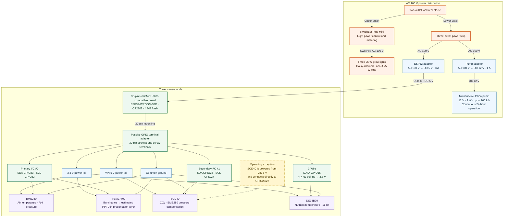
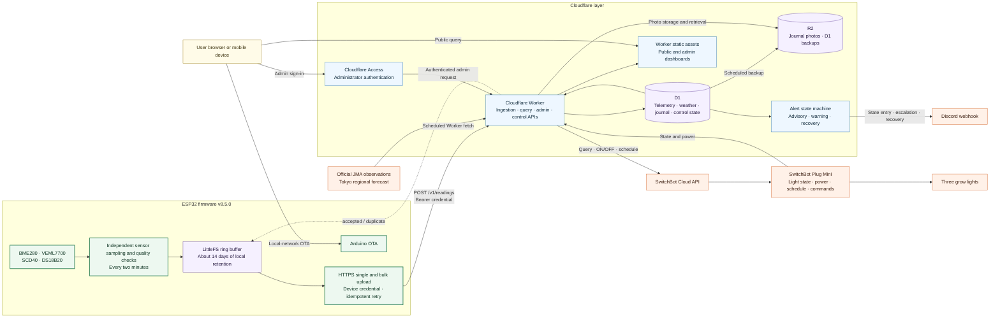

# Current Hydroponics Tower System Architecture

This document describes the hardware power and wiring architecture and the software data and
control flows of the production `home-lab / tower-01 / esp32-01` system. It excludes devices
that have not entered production, such as the planned balcony weather station.

[한국어판](TOWER_SYSTEM.md)

## 1. Hardware, power, and sensor wiring

The direct SCD40 connection is a deliberate production configuration selected by the owner based
on informal information about ESP32 digital-signal 5 V tolerance. It is not presented as a
general-purpose reference circuit based on the official datasheet and should be reviewed before
being replicated in another device.

The terminal adapter performs no voltage translation or signal amplification. It passively exposes
the ESP32 power and GPIO pins through additional sockets and screw terminals so sensors can be
wired without soldering.

## 2. Software, data, and control flow

## 3. Layer responsibilities

| Layer | Primary responsibilities | Expected behavior during an outage |
| --- | --- | --- |
| Sensors and ESP32 | Sampling, per-field validation, timestamps, local retention | Sampling and ring-buffer writes continue during a cloud outage |
| LittleFS | Retain pending and acknowledged records; backfill oldest first | Recover gaps after connectivity returns, confirming `accepted` or `duplicate` |
| Cloudflare Worker | Device authentication, ingestion/history APIs, alerts, journal, JMA, SwitchBot control | ESP32 keeps local records; remote query and control pause temporarily |
| D1 | Primary telemetry and operational metadata database | Recoverable from R2 backups |
| R2 | Journal photos and scheduled D1 backups | Long-term storage separated from live D1 ingestion |
| Dashboard | Query, visualization, and administrative UI | Does not affect device sampling or local retention |
| SwitchBot | Grow-light state and power queries, schedules, and remote commands | SwitchBot mobile app remains an independent control path |

## 4. Identity and operational boundary

| Category | Value |
| --- | --- |
| site | `home-lab` |
| zone | `tower-01` |
| device | `esp32-01` |
| light actuator | `tower-01-grow-light` |
| time zone | `Asia/Tokyo` |
| sampling interval | Approximately 120 seconds |

GitHub and GitLab form the development layer that preserves source code, documentation, and
deployment history; they are not part of the live telemetry path. The emergency GitHub/GitLab
Pages mirrors are also static views separate from the production Cloudflare dashboard.
