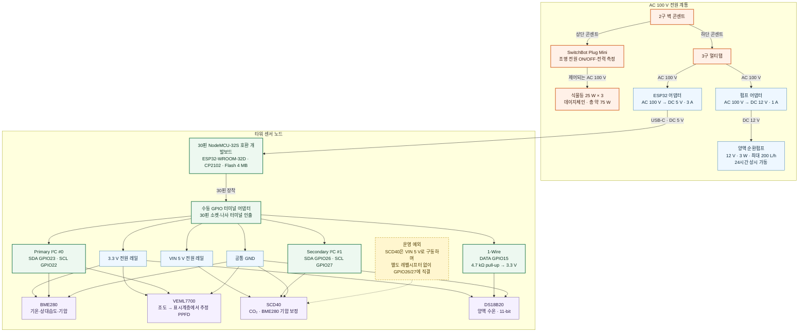
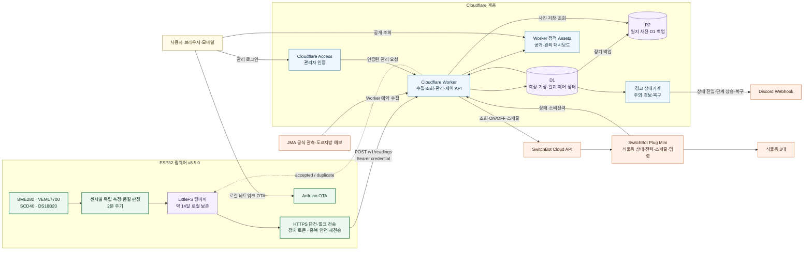

# 현재 수경재배 타워 시스템 구성도

이 문서는 현재 운영 중인 `home-lab / tower-01 / esp32-01`의 하드웨어 전원·배선과
소프트웨어 데이터·제어 흐름을 Mermaid로 정리합니다. 발코니 기상대처럼 아직
운영에 투입되지 않은 장치는 포함하지 않습니다.

[English version](TOWER_SYSTEM.en.md)

## 1. 하드웨어·전원·센서 배선

SCD40 연결은 사용자가 비공식적인 ESP32 디지털 신호 5 V 내성 정보를 근거로
의도적으로 채택한 현재 운영 구성입니다. 공식 데이터시트 기반의 일반 권장 회로로
간주하지 않으며, 다른 장치에 그대로 복제할 때는 별도 검토가 필요합니다.

터미널 어댑터는 전압 변환이나 신호 증폭을 하지 않습니다. ESP32의 전원·GPIO를
암소켓과 나사식 터미널로 수동 인출해 납땜 없이 센서 배선을 확장하는 역할입니다.

## 2. 소프트웨어·데이터·제어 흐름

## 3. 계층별 책임

| 계층 | 주요 책임 | 장애 시 기대 동작 |
| --- | --- | --- |
| 센서·ESP32 | 측정, 필드별 유효성 판정, 타임스탬프, 로컬 보존 | 클라우드 장애 중에도 측정과 링버퍼 기록 지속 |
| LittleFS | 미전송·전송완료 레코드 보존, 오래된 순서의 백필 | 연결 복구 후 `accepted`/`duplicate` 응답을 확인하며 공백 복구 |
| Cloudflare Worker | 장치 인증, ingestion/history API, 경고, 일지, JMA, SwitchBot 제어 | 실패 중 ESP32는 로컬 기록; 원격 조회·제어는 일시 중단 |
| D1 | 측정값과 운영 메타데이터의 1차 데이터베이스 | R2 백업으로 복구 가능 |
| R2 | 일지 사진과 D1 정기 백업 | D1 실시간 수집과 분리된 장기 보존 |
| 대시보드 | 조회·시각화·관리 UI | 장치 측정과 로컬 보존에는 영향 없음 |
| SwitchBot | 식물등 상태·전력 조회와 스케줄·원격 명령 | 앱을 통한 독립 제어 경로 유지 |

## 4. 식별자와 운영 경계

| 구분 | 값 |
| --- | --- |
| site | `home-lab` |
| zone | `tower-01` |
| device | `esp32-01` |
| 조명 actuator | `tower-01-grow-light` |
| 시간대 | `Asia/Tokyo` |
| 측정 간격 | 약 120초 |

GitHub와 GitLab은 소스·문서·배포 이력을 보존하는 개발 계층이며 실시간 센서
데이터 경로에는 포함되지 않습니다. 비상용 GitHub/GitLab Pages 역시 운영
Cloudflare 대시보드와 분리된 정적 화면입니다.
